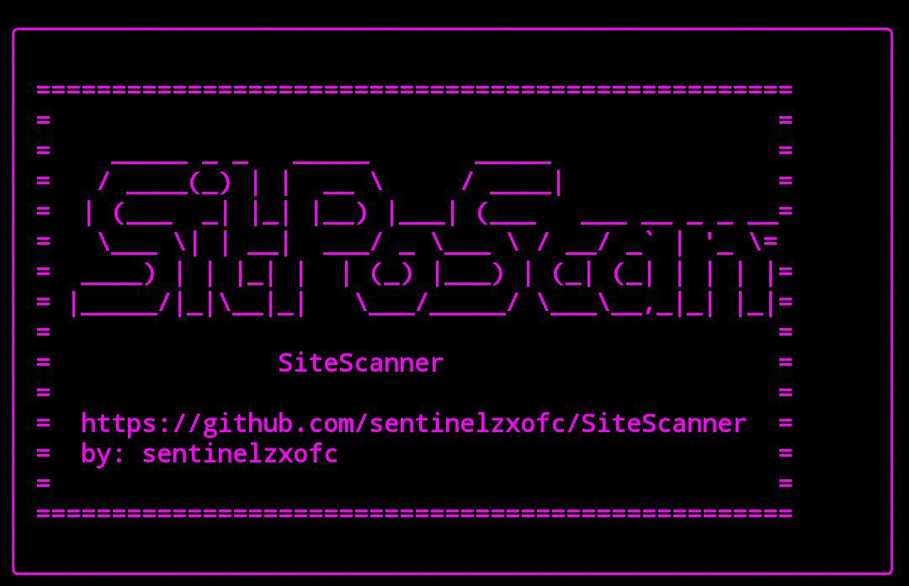
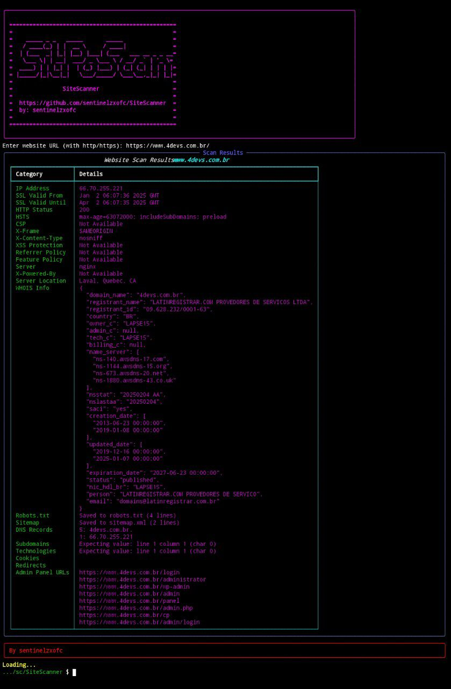

# SiteScanner 🔍



## Sobre o Projeto 🚀
**SiteScanner** é uma ferramenta avançada para análise de websites. Ele permite verificar informações como:

- Endereço IP e localização do servidor 🌍
- Certificado SSL 🔒
- Status HTTP 📡
- Cabeçalhos de segurança 🛡️
- Páginas de administração ocultas 🔐
- Informações do servidor e tecnologias utilizadas ⚙️
- Registros DNS, subdomínios e muito mais!



## 📌 Requisitos
Antes de instalar o SiteScanner, certifique-se de ter os seguintes pacotes instalados:

- Python 3.7+ 🐍
- `git` instalado no sistema

## 🛠️ Instalação

### Linux / MacOS
```bash
git clone https://github.com/sentinelzxofc/SiteScanner.git
cd SiteScanner
chmod +x install.sh
bash install.sh
```

### Windows (Powershell)
```powershell
git clone https://github.com/sentinelzxofc/SiteScanner.git
cd SiteScanner
bash install.sh
```

### Termux (Android) 📱
```bash
pkg update && pkg upgrade -y
pkg install python git -y
git clone https://github.com/sentinelzxofc/SiteScanner.git
cd SiteScanner
bash install.sh
```

## 🎯 Como Usar
Após a instalação, execute o scanner com o seguinte comando:
```bash
python3 scan.py
```

Digite a URL do site que deseja analisar e aguarde os resultados!

## 📜 Licença
Este projeto está sob a licença MIT. Veja o arquivo `LICENSE` para mais detalhes.

👤 Desenvolvido por [sentinelzxofc](https://github.com/sentinelzxofc)
